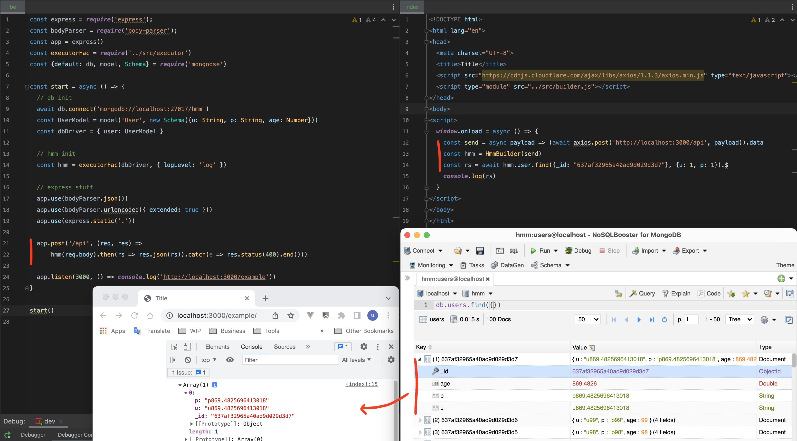

# hmmjs

Tired of REST api definition? Wanna go fast? `Hmm` come to help.

With `Hmm`, you can query your data in db from front-end side. No more API call required.

Mongodb driver, mongoose supported (Read executor.*.test.js for example)

Get rid of a ton of bored API end-points:

Just define one and only one end-point for transfering hmm payload between client side and server side.

Then query directly from front-end side as image below.

### Playaround

`npm i && npm run dev`

You may get 0 result if your db doesn't have the object id as my Db.

### Roadmap
- Explore more use cases & edge cases.
