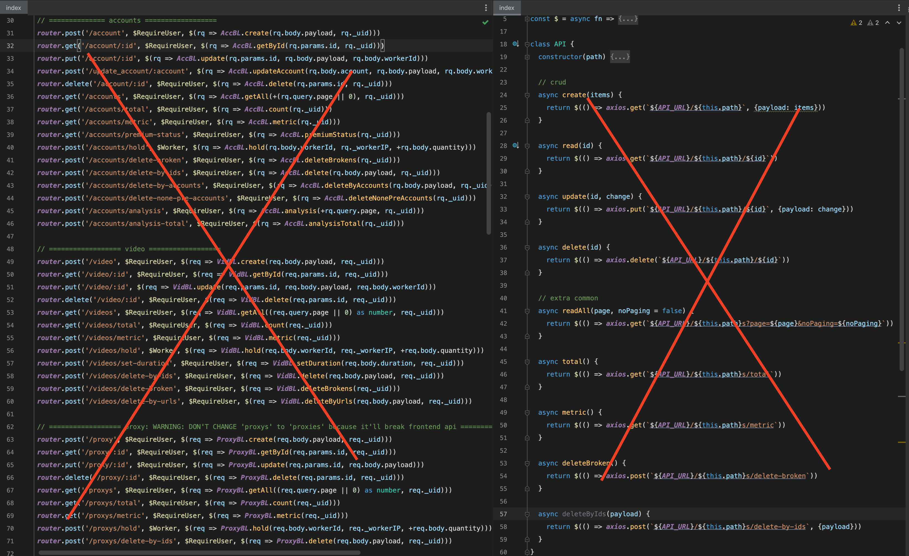

# hmmjs

Tired of REST api definition? Wanna go fast? `Hmm` come to help.

With `Hmm`, you can query your data in db from front-end side. No more API call required.

Mongodb driver, mongoose supported (Read executor.*.test.js for example)

Get rid of a ton of bored API end-points:



Just define one and only one end-point for transfering hmm payload between client side and server side.

```js
// server side
const client = new MongoClient('mongodb://localhost:27017');
// - you can define which db interface user will use (mongodb native driver/mongoose/etc) 
// - you can also define which db user will use:
//   - for e.g: user1 use db A, user2 use db B
const database = client.db('hmm')
const dbDriver = new Proxy({}, {
    get(__, p) {return database.collection(p)}
})
const hmm = executorFac(dbDriver, { logLevel: 'log' })
const app = express()
app.post(
    '/api', 
    /*use can add authorization at this middleware*/
    bodyParser.raw({limit: '50mb', type: () => true}),
    async (req, res) =>
        hmm(jsonFn.parse(req.body.toString()))
            .then(rs => res.json(rs))
            .catch(e => res.status(400).send(e.message)));
app.listen(3000)
```

Then query directly from front-end side or serverless app as simple as below.

```html
<script>
  // browser
  window.onload = async () => {
    const url = 'http://localhost:3000/api'
    const send = async (payload) => {
      const {data} = await axios.post(url, JSONfn.stringify(payload))
      return data
    }
    const Model = HmmBuilder(send)
    await Model('user').insertOne({user: 'admin', password: '123'})
    const admin = await Model('user').findOne({user: 'admin'})
    console.log('admin', admin)
  }
</script>
```

### Playaround

`npm i && npm run dev`

You may get 0 result if your db doesn't have the object id as my Db.

### Roadmap
- Explore more use cases & edge cases.
